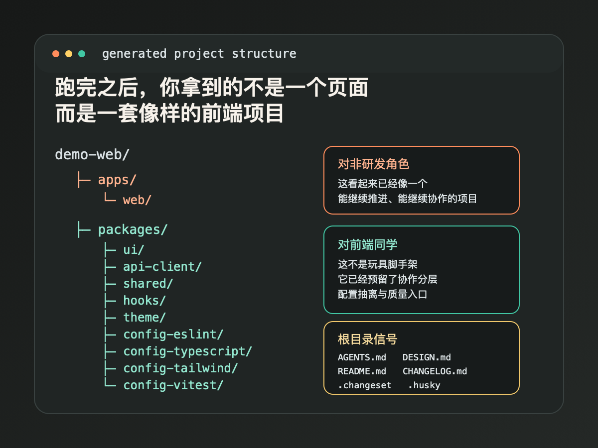

# 不会前端，也能一键起一个专业 React 项目

过去很多非研发角色已经能把想法说给 AI，但真正卡住他们的，往往不是页面生成，而是项目初始化。`react-monorepo-init` 把 React 19 + TypeScript + Vite + Router + Query + Zustand + Tailwind CSS v4 + 测试基线一次搭好，让产品、设计、运营、销售也能在 agent 协作下直接启动 demo、MVP 和内部工具；更重要的是，它给前端团队留下的，不是一堆一次性页面，而是一套看起来就很专业、也真的能继续演进的前端起点。

今天越来越多团队已经接受了一件事：**产品、设计、运营、销售，甚至创始人自己，都可以直接和 AI 一起做原型、做 demo、做 MVP。**

但真正把这件事做顺的人，很快会遇到一个更真实的瓶颈：**问题不在“AI 会不会写页面”，而在“AI 从什么起点开始写”。**

如果起点只是一个空目录，加上一句“帮我做个页面”，你最后往往拿到的是一份能截图、能演示、但不太能继续往下做的产物。它可以完成第一眼的惊艳，却很难支撑第二轮需求。

这也是我们最近越来越确认的一件事：**AI 时代最该被标准化的，不只是 prompt，而是项目初始化。**

## 一、现在最大的阻力，不是想法，而是初始化

很多非研发角色并不缺想法，也不缺表达能力。

产品经理可以把需求说得很清楚，设计师可以把界面和流程表达得很完整，运营知道自己要什么工具，销售也很清楚一个 demo 应该打动客户的哪个点。

但只要事情一落到“真正做一个前端项目”，难点就会突然冒出来：目录怎么切、路由怎么组织、接口请求放哪、本地状态和服务端状态怎么分、样式体系怎么起、测试是不是现在就要带。

这些问题单独看都不算大，合在一起却足以把一个本来应该快速验证的需求，拖进技术选型和工程细节的沼泽里。

于是通常只会出现三种情况：

1. **停留在静态稿。**  
   需求讲清楚了，界面也画出来了，但真正可交互、可试用的版本没有出现。

2. **得到一个一次性页面。**  
   AI 很快拼出一个 demo，可一旦你要接 API、补路由、做第二个页面、加一点测试，结构马上开始发散。

3. **重新排队等前端资源。**  
   团队最终还是回到传统模式，因为没人愿意在一份不成体系的初始产物上继续堆。

所以，真正卡住很多人的，从来不是“有没有灵感”，而是**有没有一个足够专业的前端起点**。

## 二、`react-monorepo-init` 到底一次性帮你搭了什么

`react-monorepo-init` 的价值，不在于它抽象地说“给你一个 React 项目”，而在于它把现代前端项目最容易分散决策的那一段，一次性收束成默认答案。

它直接搭出来的是这样一套基线：

- **React 19 + TypeScript**：保证现代前端表达能力和类型化协作基础。
- **Vite**：保持开发启动轻快，不把第一步浪费在沉重工具链上。
- **React Router**：让页面流程、信息架构和路径组织从一开始就是显式的。
- **TanStack Query**：把服务端状态拉回规范入口，避免请求逻辑散在各处。
- **Zustand**：处理本地状态时保持轻量，不把所有问题都塞进一种模式。
- **Tailwind CSS v4**：让界面搭建速度足够快，适合 demo 和 MVP 的迭代节奏。
- **Vitest / MSW / Playwright**：把单元测试、接口模拟和端到端验证预埋进项目，而不是以后再补。
- **pnpm monorepo baseline**：从第一天就给共享 UI、hooks、theme、配置包预留清晰落点。

这背后最重要的，不是“栈更全”，而是**项目的边界和职责被提早定义出来了**。

可选增强项也被克制地限定在几个高频方向：`ci`、`storybook`、`pwa`、`i18n`。这其实是一个很重要的信号：它不是想一口气替你决定所有技术问题，而是要把“标准起点”这件事先做对。

也因此，它**不会默认帮你绑定后端、认证、部署平台或埋点方案**。这不是缺陷，而是一种边界感。因为对于 demo、MVP 和早期验证来说，最大的风险往往不是功能不够全，而是起步就过载。

## 三、跑完之后，你拿到的不是一个页面，而是一套像样的前端项目

很多人第一次真正被说服，不是听到 React 19、Vite、Query 这些词的时候，而是看到生成结果的时候。

**跑完之后，你拿到的不是一个页面，而是一套像样的前端项目。**



```text
demo-web/
├─ apps/
│  └─ web/
├─ packages/
│  ├─ ui/
│  ├─ api-client/
│  ├─ shared/
│  ├─ hooks/
│  ├─ theme/
│  ├─ config-eslint/
│  ├─ config-typescript/
│  ├─ config-tailwind/
│  └─ config-vitest/
├─ .changeset/
├─ .husky/
├─ AGENTS.md
├─ DESIGN.md
├─ README.md
├─ CHANGELOG.md
└─ commitlint.config.js
```

这棵树的魅力，不在于“文件很多”，而在于**职责已经被预先分层**。

对非研发角色来说，它传递的是一种很具体的安全感：这不是一个只能演示一次的临时网页，而是一套真正可以接着做、接着改、接着协作的项目。

对前端同学来说，它传递的是另一种信号：这不是玩具脚手架。它已经把共享包、工程配置、文档骨架、变更记录、提交规范和质量入口都预留好了。

**这也是为什么它会同时吸引非研发和前端同学。**

前者看到的是“我终于可以自己把想法跑起来”；后者看到的是“终于不是又一坨只能推倒重来的代码”。

## 四、为什么前端工程师也应该关心这种 skill

如果把这种能力理解成“以后非研发就不需要前端了”，那就是典型的 AI 误读。

更准确的说法是：**前端工程师最不值得被重复消耗的那部分初始化劳动，正在被标准化。**

前端团队经常把大量时间花在类似的问题上：目录怎么切、基础配置怎么抽、共享 UI 包什么时候拆、测试入口怎么起、文档骨架要不要先带上。它们都重要，但它们也高度重复。

把这些动作沉淀成 skill，有两个直接好处。

第一，**项目 bring-up 成本会明显下降**。很多需求不是因为实现太难，而是因为开局太重，结果压根没有走到“值得认真做”的那一步。

第二，**AI 的输出会更稳定**。模型不是在真空里工作，它一边理解你的需求，一边也在读取现有结构。如果上下文本身已经清晰，AI 的补全、扩展和重构就会更少跑偏。

当然，代价也存在。`react-monorepo-init` 不是无限自由的搭建器，它明显偏向一套有品味、有约束的默认答案。你失去的是一部分初始化阶段的自由度，换来的是速度、一致性和更低的团队摩擦。

这就是它的取舍：**少一点“什么都能选”，多一点“今天就能开始，而且后面接得住”。**

## 五、为什么最先受益的反而是产品、设计、运营、销售

真正最先感受到变化的，往往不是工程师，而是那些过去离“可运行软件”只差一步、却总跨不过去的人。

### 产品经理

产品经理最常见的痛点，不是想不清楚，而是验证版本迟迟出不来。

例如，一个 onboarding 流程已经写清楚了，下一步最有价值的不是继续讨论，而是拉用户看一遍真实可点的版本。以前这一步往往要等前端资源；现在，至少可以先在标准基线上把流程跑起来。

**变化不只是更快，而是验证节奏被前移了。**

### 设计师

设计师过去的交付，很多时候停在静态稿和高保真原型。

但只要进入真实路由、状态切换、接口模拟，体验的判断就会更接近真实产品。标准项目起点让设计师第一次更容易把交付往前推到“接近上线行为”的层级，而不是只停在视觉层。

**变化不只是更像代码，而是更像真实使用过程。**

### 运营

运营同学常常需要活动页、小后台、表单工具、内部台账。最麻烦的并不是页面本身，而是每次都要从零开局。

当项目初始化被标准化后，这类需求第一次拥有了可复用的起点。不是每个需求都值得正式立项，但很多需求都值得先被快速验证。

**变化不只是省时，而是让“小需求也配得上一个专业起点”。**

### 销售 / 解决方案

很多销售 demo 的窗口期非常短。真正丢掉机会的，往往不是方案不好，而是来不及把方案变成可演示的东西。

有了标准基线，客户定制 demo、行业化 PoC、场景化展示页就不必总从 PPT 开始。先把项目起起来，再让 AI 和团队一起往里填内容，速度会快很多。

**变化不只是更会演示，而是更容易在机会窗口里交付可信的东西。**

## 六、现在就可以怎么开始

如果你想直接试，这两个入口最重要：

- npm: [@aicode-nexus/skills](https://www.npmjs.com/package/@aicode-nexus/skills?activeTab=readme)
- GitHub: [AICode-Nexus/skills](https://github.com/AICode-Nexus/skills)

先看看现在有哪些已发布的 skills：

```bash
npx -y @aicode-nexus/skills list
```

安装 `react-monorepo-init`。如果你在 Codex 里使用，默认会装到 `~/.codex/skills`：

```bash
npx @aicode-nexus/skills install react-monorepo-init
```

如果你在 Claude Code 里使用，可以显式指定用户目录：

```bash
npx @aicode-nexus/skills install react-monorepo-init --dest ~/.claude/skills
```

如果你想把它先装到项目目录，方便团队共享、纳入版本控制或后续二次分发：

```bash
npx @aicode-nexus/skills install react-monorepo-init --dest ./tools/agent-skills
```

安装完成后，重新打开 agent 会话，就可以在实际工作流里调用它。

## 最后

AI coding 真正变成生产力，不在于一句 prompt 能吐出多少代码，而在于它是不是从一个**正确、标准、可继续演进**的起点开始工作。

对非研发角色来说，这意味着第一次真正有机会把想法直接推到可验证产品。  
对前端团队来说，这意味着重复搭建的时间可以被省下来，把精力留给更值得做的工程判断。

如果你这周正好想做一个 demo、一个 MVP，或者一套内部工具，不妨先从这里开始：

- 先去 npm 看安装说明：[@aicode-nexus/skills](https://www.npmjs.com/package/@aicode-nexus/skills?activeTab=readme)
- 再去 GitHub 看仓库与源码：[AICode-Nexus/skills](https://github.com/AICode-Nexus/skills)
- 然后实际装上 `react-monorepo-init`，让 AI 帮你把第一个专业 React 项目起起来

**先把场地搭对，再让 AI 开工。**
